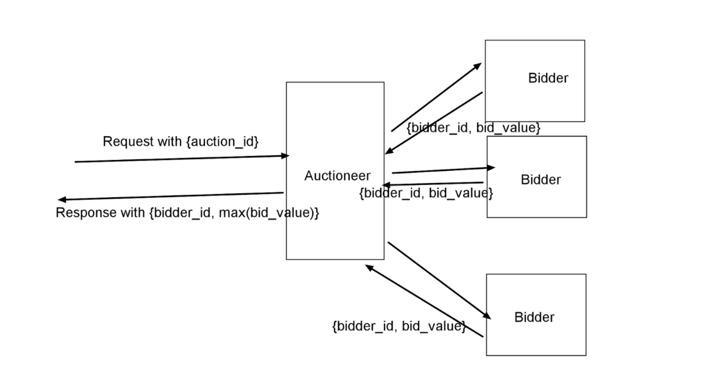

# auction
An auction system

# Problem statement
- An auction system which can auction bids and select the winning bid such that it always responds before a specific time interval. 

Current state of development

- Information is not persistant.
- Auctioner needs to be up & running before bidders.
- 1 Auctioner & 3 Bidders. (Bidders can be increased easily).
- sychroization is currenty handeled through channels. 

Steps to run:
- greedy/auctioner 
   go run main.go 
- greedy/bidder
   go run main.go
- greedy/bidder1        	
   go run main.go
- greedy/bidder2        	
   go run main.go   

Endpoints:
- Fetch all registered bidder endpoints
GET : http://localhost:8080/bidder

- Run an auction
POST: http://localhost:8080/auction

Future Enhancements:
- Dockerize the application.
- start the application with doker-compose.
- grpc implementaion.
- implement websocket connection for Auctioner & bidder communication.
- Authentication [could be session based, token based, jwt etc.]
- Better routing implementation.
- scale it for 1000X number of bidders.
- write test cases.
- use go mod to restructure the project.
- async processing through any messaging queue application [RabbitMq, Redis, Kafka etc.]
- and so on....
